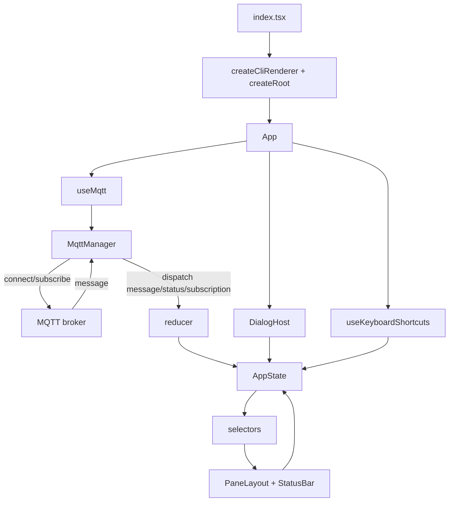

# termqtt

To install dependencies:

```bash
bun install
```

To run:

```bash
bun run index.tsx
```

## Install (binary releases)

Each release ships a single zip per OS/arch that contains the binary and the TreeSitter worker.

macOS / Linux:

```bash
curl -fsSL https://raw.githubusercontent.com/<owner>/<repo>/main/scripts/install.sh | bash -s -- <owner>/<repo>
```

Windows (PowerShell):

```powershell
iwr https://raw.githubusercontent.com/<owner>/<repo>/main/scripts/install.ps1 -UseBasicParsing -OutFile install.ps1
./install.ps1 -Repo <owner>/<repo>
```

## Package locally (macOS)

```bash
bun run scripts/package.ts
```

This project was created using `bun init` in bun v1.3.6. [Bun](https://bun.com) is a fast all-in-one JavaScript runtime.

## Architecture

- CLI UI built with `@opentui/react` and `@opentui/core`
- `index.tsx` boots the CLI renderer and renders `<App />`
- `src/app/App.tsx` composes panes, dialogs, and hooks
- State lives in `src/state.ts` and updates via `src/app/reducer.ts`
- MQTT lifecycle handled by `src/mqtt.ts` through `src/hooks/useMqtt.ts`
- Selectors in `src/app/selectors.ts` shape state for display

## Data Flow

1. App starts in `index.tsx` and renders `<App />`.
2. `useMqtt` creates an `MqttManager` with callbacks that dispatch reducer actions.
3. `MqttManager.connect()` establishes the MQTT connection and subscribes to the configured filter.
4. Incoming MQTT messages dispatch `action: "message"`.
5. The reducer stores the message, updates topic lists and counters.
6. Selectors derive tree entries, payload entries, status text, and details content.
7. Panes render from derived data; status bar reflects connection + subscription info.
8. Keyboard shortcuts and dialogs dispatch state updates that feed back into the same flow.


