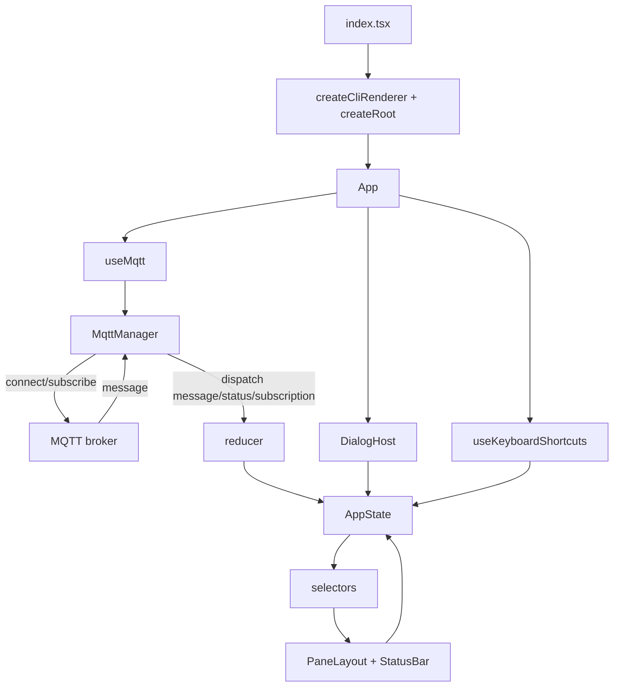

# termqtt

termqtt is a terminal-based MQTT monitoring and debugging app built with Bun + OpenTUI.
It subscribes to your configured root topic, organizes messages in a three-pane layout, and lets you inspect,
filter, watch, favorite, and publish JSON payloads without leaving the terminal.

## Highlights
- Live MQTT monitoring with connection status, search, and exclude filters.
- Two-row UI: Topics + Payload + Details (top), Favourites + Watchlist (bottom).
- JSON flattening for quick scanning with type-aware coloring.
- Inline editing and publishing for existing messages or new payloads.
- Saved messages library for quick re-use.
- Persistent broker config, exclude filters, watchlist, favourites, and saved messages.

## Screenshots & Demo
Drop screenshots or a short demo GIF in an `assets/` folder (recommended).

Placeholders (replace with real captures):


Suggested capture list:
- Overview: all panes with active connection and a few topics.
- Search + filters: `/` search active and filter status in header.
- Favourites + watchlist: starred topic and watched keys with values.
- Details view: JSON pretty-printing with syntax color.
- Edit dialog: key/value edit with preview and saved messages list.
- New message dialog: key/value editing with preview.
- Help dialog: context help overlay.

## Install (binary releases)

Each release ships a single zip per OS/arch that contains the binary and the TreeSitter worker.

macOS / Linux:

```bash
curl -fsSL https://raw.githubusercontent.com/<owner>/<repo>/main/scripts/install.sh | bash -s -- <owner>/<repo>
```

Windows (PowerShell):

```powershell
iwr https://raw.githubusercontent.com/<owner>/<repo>/main/scripts/install.ps1 -UseBasicParsing -OutFile install.ps1
./install.ps1 -Repo <owner>/<repo>
```

## Quick Start (dev)

Install dependencies:

```bash
bun install
```

Run:

```bash
bun run index.tsx
```

Build compiled binary:

```bash
bun build --compile ./index.tsx --outfile dist/termqtt
```

Package zip (local):

```bash
bun run scripts/package.ts
```

## Broker Setup

On first run (or any time later), press `b` to configure the broker.
Configuration is saved under `$XDG_CONFIG_HOME/termqtt` (or `~/.config/termqtt`).
On Windows it uses `%APPDATA%\termqtt`.

## CLI flags

```bash
termqtt --help
termqtt --version
termqtt -b localhost -P 1883 -r sensors/#
termqtt --broker mqtt.example.com --tls --user alice --password secret -r devices/#
```

Flags:
- `-h`, `--help` show help
- `-v`, `--version` show version
- `-b`, `--broker` broker host
- `-P`, `--port` broker port
- `-u`, `--user` username
- `-w`, `--password` password
- `-t`, `--tls` enable TLS
- `-r`, `--root-topic` root topic (subscribe filter)

## User Guide

### Layout Overview
- Top row: Topics (left), Payload (middle), Details (right).
- Bottom row: Favourites (left), Watchlist (right).

### Core Workflow
1. Select a topic in the Topics pane to view its payload and details.
2. Press `space` on a topic to toggle it as a favourite.
3. Press `space` on a payload key to add/remove it from the watchlist.
4. Use `/` to search topics and `f` to manage exclude filters.
5. Press `e` in Details to edit and publish the selected message.
6. Press `n` anywhere to create and publish a new message.

### Search
- `/` start search
- Type to filter topics (live)
- `Esc` cancel

### Exclude Filters
Exclude filters hide topics when their pattern matches (defaults: `read`, `data`, `config`).
- `f` open the exclude filters dialog
- `space` toggle exclude for the selected filter
- `a` add a new exclude filter
- `e` edit the selected filter
- `d` delete the selected filter
- `Enter` apply filters
- `Esc` cancel

### Keyboard Shortcuts (Global)
- `Tab` / `Shift+Tab` cycle panes
- `1` Topics, `2` Payload, `3` Details, `4` Favourites, `5` Watchlist
- `j` / `k` move selection
- `h` / `l` collapse/expand tree in Topics
- `b` open broker configuration
- `/` search topics
- `f` exclude filters
- `n` publish new
- `?` open help dialog
- `q` quit

### Pane Actions

Topics pane:
- `space` toggle favourite for selected topic

Favourites pane:
- `space` remove favourite
- `r` rename favourite

Payload pane:
- `space` toggle watchlist for selected key

Watchlist pane:
- `space` remove watchlist entry

Details pane:
- `e` edit selected message and publish

## Publishing and Editing

### Edit Message Dialog (`e`)
- `Tab` / `Shift+Tab` move between fields and key/value columns
- `j` / `k` move between rows
- `Ctrl+n` add row
- `Ctrl+d` delete row (or `Ctrl+Backspace`)
- `Ctrl+k` clear current field
- `Ctrl+x` clear all fields
- `Ctrl+r` toggle `read`/`write` in topic
- `Ctrl+s` save message to the library
- `Ctrl+l` focus saved messages list
- `Enter` publish (if valid)
- `Esc` close

### New Message Dialog (`n`)
Same controls as Edit dialog.

### Saved Messages List (within dialogs)
- `j` / `k` move selection
- `Enter` load saved message into the editor
- `d` or `Delete` remove saved message

### Broker Configuration Dialog
- `Tab` / `Shift+Tab` move between fields
- `Enter` save and reconnect
- `Esc` cancel

## Persistence
termqtt stores local data under `$XDG_CONFIG_HOME/termqtt` (or `~/.config/termqtt`).
On Windows it uses `%APPDATA%\termqtt`.
- `termqtt_broker.json` broker configuration
- `termqtt_watchlist.json` watchlist entries
- `termqtt_favourites.json` favourite topics
- `termqtt_saved_messages.json` saved messages library
- `termqtt_filters.json` exclude filters

## Troubleshooting
- Terminal not restored: run `reset`.
- Can’t connect: press `b`, verify host/port/credentials, and confirm broker is running.
- Watchlist or favourites not saving: check file permissions in the config directory.

## Architecture

- CLI UI built with `@opentui/react` and `@opentui/core`
- `index.tsx` boots the CLI renderer and renders `<App />`
- `src/app/App.tsx` composes panes, dialogs, and hooks
- State lives in `src/state.ts` and updates via `src/app/reducer.ts`
- MQTT lifecycle handled by `src/mqtt.ts` through `src/hooks/useMqtt.ts`
- Selectors in `src/app/selectors.ts` shape state for display

## Data Flow

1. App starts in `index.tsx` and renders `<App />`.
2. `useMqtt` creates an `MqttManager` with callbacks that dispatch reducer actions.
3. `MqttManager.connect()` establishes the MQTT connection and subscribes to the configured filter.
4. Incoming MQTT messages dispatch `action: "message"`.
5. The reducer stores the message, updates topic lists and counters.
6. Selectors derive tree entries, payload entries, status text, and details content.
7. Panes render from derived data; status bar reflects connection + subscription info.
8. Keyboard shortcuts and dialogs dispatch state updates that feed back into the same flow.



## Development

```bash
# Run in dev
bun run index.tsx

# Run tests
bun test
```

## License
Add license details here.
